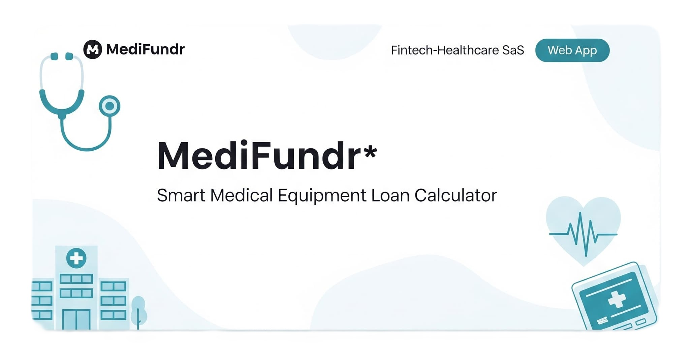
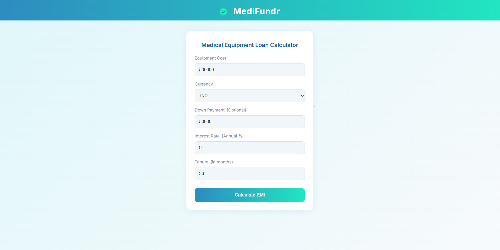
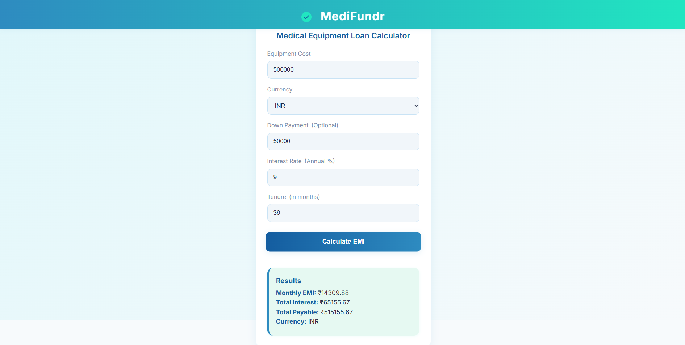

# MediFundr 💊💰  
**Smart Medical Equipment Loan Calculator**




MediFundr is a responsive full-stack web app that helps clinics and hospitals estimate financing plans for purchasing medical equipment. It simplifies complex EMI calculations and supports real-time currency conversion (USD → INR), making it especially useful for international planning.

> 💡 This project aligns with the domain of companies that enable affordable medical equipment distribution and financing.

---

## 🚀 Live Demo

- 🌐 **Frontend**: [https://medi-fundr.vercel.app](https://medi-fundr.vercel.app)
- 🔧 **Backend**: [https://medifundr.onrender.com](https://medifundr.onrender.com) (used by frontend for calculations)

---

## ✨ Features

- Calculate EMI for medical equipment loans in **INR or USD**
- **Live USD → INR exchange rate** conversion
- Displays:
  - Monthly EMI
  - Total Interest
  - Total Payable Amount
- Responsive, minimalist UI
- Input validation and error handling
- Backend built with **Node.js + Express**
- CORS-enabled for Vercel and localhost compatibility

---

## 🏥 Why MediFundr?

MediFundr empowers healthcare providers to make informed, affordable equipment purchases. Its clean, trustworthy UI and robust backend logic make it ideal for health-fintech platforms, supporting better financial decisions in healthcare.

---

## 🛠️ Technologies Used

- **Frontend**: HTML5, CSS3, JavaScript (ES6+), Google Fonts (Inter)
- **Backend**: Node.js, Express.js
- **Currency API**: Live exchange rate API
- **Other Tools**: Fetch API, dotenv, CORS
- *(Optional)* Tailwind CSS or Chart.js for enhancements

---

## 📸 Screenshots

> Input Form And EMI Results after API fetch

| Input Form | EMI Results |
|------------|-------------|
|  |  |

---

## 📦 Folder Structure

```
MediFundr/
├── index.js                # Express backend
├── routes/
│   └── loan.js             # EMI route logic
├── utils/
│   ├── emiCalculator.js    # EMI formula
│   └── fetchExchangeRate.js# Currency API logic
├── public/
│   └── index.html          # Frontend UI
├── .env                    # API key (optional)
└── README.md
```

---

## 📄 API Overview

### `POST /api/loan/calc`

**Request Body:**
```json
{
  "amount": 500000,
  "rate": 8.5,
  "tenure": 36,
  "currency": "USD",
  "downPayment": 50000
}
```

**Response:**
```json
{
  "monthlyEMI": 14205.39,
  "totalInterest": 61394.11,
  "totalPayable": 511394.11,
  "currency": "INR"
}
```

---

## 🧪 Run Locally

```bash
# Clone the repository
git clone https://github.com/your-username/MediFundr.git
cd MediFundr

# Install dependencies
npm install

# Start the backend server
node index.js
```

Then open `public/index.html` manually in your browser or use VS Code Live Server.

---

## ⚠️ Notes

- CORS is enabled for `localhost` and your deployed frontend.
- For best reliability, consider using UptimeRobot or Render Pro plan to keep backend awake.

---

## 🙋‍♂️ Author

**Gagan Reddy** – Fullstack Developer (Node.js)  
Built in 1 day to demonstrate backend + frontend integration, currency API use, and UI clarity for healthcare tech.

---

## 📃 License

This project is open-source under the [MIT License](LICENSE).
